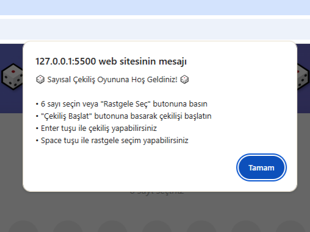
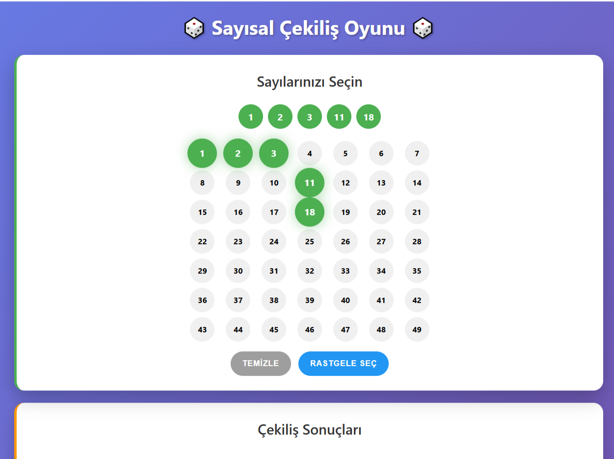
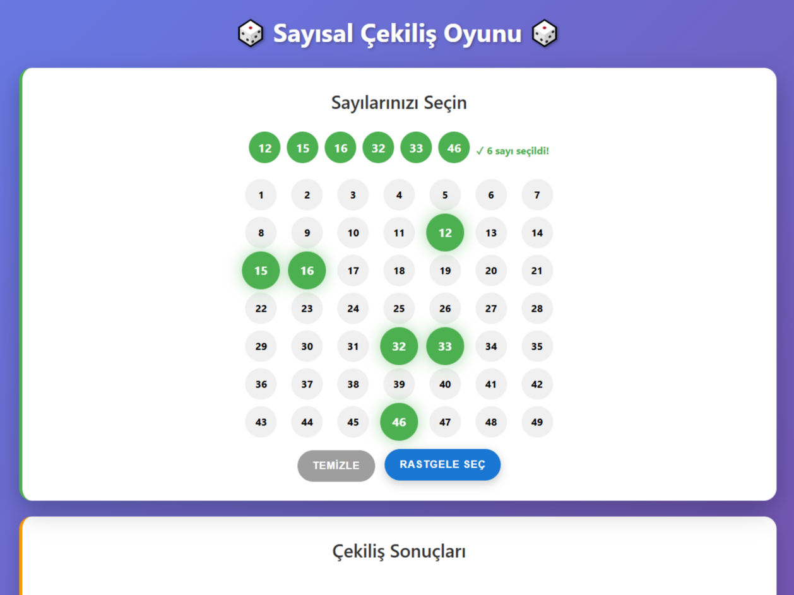
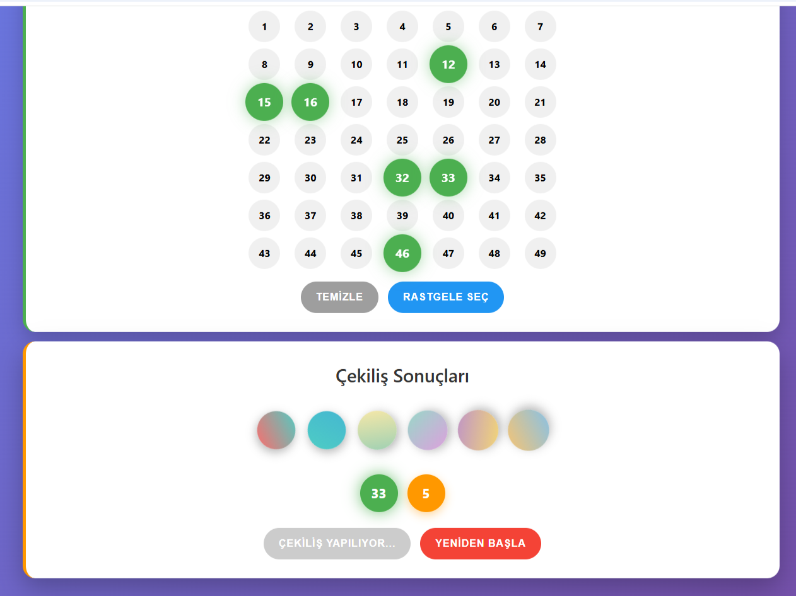
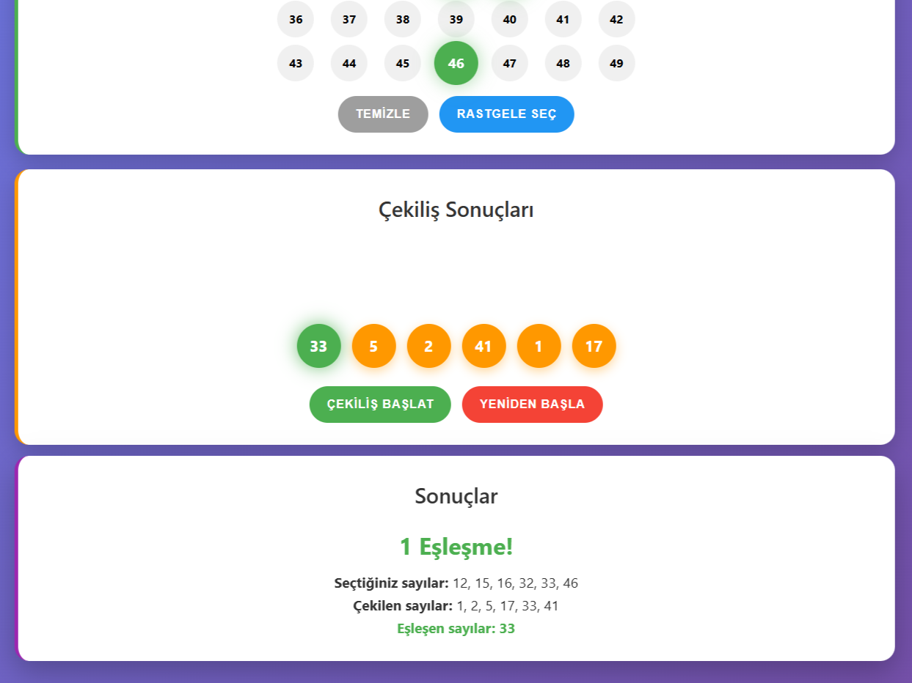

### Sayısal Çekiliş Uygulaması


Modern ve interaktif bir sayısal çekiliş uygulaması. 49 sayıdan 6'sını seçin ve çekiliş sonuçlarını görün!




## ✨ Özellikler


- **Sayı Seçimi:** 49 sayıdan 6 manuel veya random seçin.


- **Klavye Kontrolleri:** Boşluk(space) tuşu ile random seçim yapın, Enter tuşu ile çekiliş başlatın.


- **Mobil Uyum:** Touch-friendly arayüz


- **Eşleşme Kontrolü:** Seçtiğiniz sayılar ile çekiliş sonucu çıkan sayıları karşılaştırın.


## 🎨 Tasarım Özellikleri


- **Gradient Arka Plan**: Modern görünüm


- **Kart Tabanlı UI**: Temiz ve düzenli arayüz


- **Animasyonlar**: Smooth geçişler ve efektler


- **Renk Kodlaması**: Her bölüm için farklı tema


- **Hover Efektleri**: İnteraktif deneyim


## 🚀 Kurulum


### 1. Repository'yi Klonlayın:


```bash
git clone git@github.com:Cemrecicek/SayisalCekilis.git
cd SayisalCekilis
```


### 2. Uygulamayı Çalıştırın:


Web tarayıcısında `index.html` dosyasını açın:


```bash
# Windows
start index.html

# macOS
open index.html

# Linux
xdg-open index.html
```


### 3. Uygulamayı Test Edin:

- Tarayıcıda uygulama açılacak


- 6 sayı seçin veya "Rastgele Seç" butonuna basın


- "Çekiliş Başlat" butonuna basarak test edin

### Uygulamadan:




